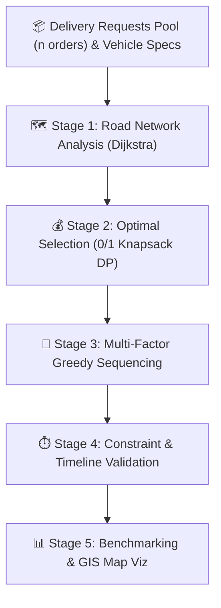

<div align="center">
  
  
  # RouteX — Intelligent Last-Mile Delivery Optimizer
  
  **"Select smarter. Route faster. Deliver on time."**

  <p align="center">
    <a href="https://react.dev/"></a>
    <a href="https://fastapi.tiangolo.com/"></a>
    <a href="https://www.python.org/"></a>
    <a href="https://www.typescriptlang.org/"></a>
    <a href="https://tailwindcss.com/"></a>
  </p>

  *A Production-Grade College DAA PBL (Project-Based Learning) Flagship Project*<br>
  **Topic:** Last-Mile Delivery with Deadlines (0/1 Knapsack DP + Dijkstra + Greedy Heuristics)
</div>

---

## 📸 Application Previews

*(Add screenshots of your application here after running it! Just replace the placeholder image links.)*

| Dashboard & Metrics | Interactive Map & Route Simulator |
| :---: | :---: |
|  |  |
| **0/1 Knapsack DP Visualizer** | **Greedy Priority Scheduling** |
|  |  |

---

## 🚀 1. Project Overview & Problem Statement

In contemporary urban logistics, last-mile delivery represents over **53% of total logistics costs**. Small and medium-sized delivery operators operate under strict vehicle weight limits, variable road traffic, and tight customer delivery deadlines. When customer demand exceeds vehicle capacity ($C$), dispatchers face a critical combinatorial optimization problem:

1. 📦 **Order Acceptance:** Which delivery requests must be accepted to maximize total profit while strictly obeying vehicle payload capacity?
2. 🚫 **Order Rejection:** Which orders must be rejected because their inclusion yields suboptimal profit or causes deadline violations?
3. 🚚 **Dispatch Sequencing:** In what sequence should accepted orders be delivered to ensure all customer delivery windows are satisfied?
4. 🗺️ **Network Routing:** What is the shortest-travel path across the urban road network accounting for real-time traffic congestion?
5. ⏱️ **Timeline Feasibility:** Can every customer order be fulfilled on time, and what is the slack time margin?

**RouteX** is a production-grade algorithmic decision-support and route-optimization system designed to solve this multi-stage pipeline deterministically without mock data or simulated numbers.

---

## 🧠 2. Multi-Stage Algorithmic Architecture

The optimization pipeline executes in five sequential algorithmic stages:



---

## 🔬 3. Detailed Algorithmic Formulations & Complexity

### Algorithm A: 0/1 Knapsack via Dynamic Programming (Order Selection)
- **Role:** Selects the global profit-maximizing subset of deliveries that fits within integer vehicle capacity $C$.
- **Assumption:** Vehicle capacity is discretized into kilograms ($1\text{ kg}$ resolution).
- **Recurrence Relation:**
  $$\text{dp}[i][c] = \begin{cases} \max\left(\text{dp}[i-1][c],\, \text{profit}[i] + \text{dp}[i-1][c - \text{weight}[i]]\right) & \text{if } \text{weight}[i] \le c \\ \text{dp}[i-1][c] & \text{otherwise} \end{cases}$$
- **Complexity:** Time $\mathcal{O}(n \cdot C)$ | Space $\mathcal{O}(n \cdot C)$ | **Globally Optimal**

### Algorithm B: Dijkstra's Shortest Path Algorithm (Network Travel Times)
- **Role:** Finds the shortest road network travel path and duration between transfer hubs and delivery waypoints.
- **Graph Formulation:** Weighted undirected graph $G = (V, E)$, with dynamic traffic multiplier.
- **Complexity:** Time $\mathcal{O}((V + E) \log V)$ | Space $\mathcal{O}(V + E)$ | **Globally Optimal**

### Algorithm C: Deadline-Aware Greedy Heuristic (Route Construction)
- **Role:** Sequences accepted deliveries into an efficient delivery schedule starting and terminating at the Depot.
- **Formulas:** Priority Score considers Urgency, Profit, Weight, and Estimated Travel Time.
- **Complexity:** Time $\mathcal{O}(k^2)$ | Space $\mathcal{O}(k)$ | **Practical Heuristic**

### Algorithm D: Constraint & Schedule Validator
- **Role:** Verifies all physical and contract guarantees (Capacity, Slack $\ge 0$, Precedence).

---

## 💻 4. Technology Stack

### Backend
- **Python 3.10+**: Core algorithm logic and numeric scaling.
- **FastAPI**: Asynchronous REST API Engine.
- **Pydantic v2**: Data validation and strict typing.
- **Pytest**: 19 automated tests for rigorous algorithm verification.

### Frontend
- **React 19 + TypeScript**: Modern component-based SPA architecture.
- **Vite**: Lightning-fast build tool and dev server.
- **Tailwind CSS v4**: Beautiful, dark navy SaaS logistics design system.
- **Leaflet & OpenStreetMap**: Interactive GIS route mapping.
- **Recharts**: Algorithmic comparative analytics.

---

## ⚙️ 5. Installation & Quick Start

### Prerequisites
- [Python 3.10+](https://www.python.org/downloads/)
- [Node.js 18+](https://nodejs.org/)

### Quick Start (Windows)

Simply clone the repository and run the provided startup script:

```bash
git clone https://github.com/yasheswar/RouteX.git
cd RouteX
./run.bat
```
*(This script will automatically install all Python and NPM dependencies and launch both servers!)*

### Manual Setup

<details>
<summary>Click here for manual setup instructions</summary>

**Terminal 1: Backend**
```bash
cd backend
python -m venv .venv
.venv\Scripts\activate
pip install fastapi uvicorn pydantic pytest httpx
$env:PYTHONPATH="."
python -m uvicorn app.main:app --host 127.0.0.1 --port 8001
```

**Terminal 2: Frontend**
```bash
cd frontend
npm install
npm run dev
```
</details>

---

## 🎓 6. Guided Viva Demonstration Script

1. **Open the Application (`http://localhost:5173`)**: Point out the dark navy SaaS logistics aesthetic. Show the 4 top metrics.
2. **Interactive Viva Defense Mode**: Click the **"🎓 Viva Defense Mode"** button in the top navigation bar. Demonstrate the Live Recurrence Calculator and Faculty Stress-Tests.
3. **Multi-Stage Optimization**: Show the DP Selection Table, the Greedy Prioritization logic, and the Detailed Dispatch Schedule.
4. **Interactive Map & Live Simulator**: Watch the animated delivery van move stop-by-stop along the route with live payload and timeline HUD updates.
5. **What-If Simulation**: Adjust vehicle capacity or traffic multiplier and run deterministic sensitivity tests.

---

## ✅ 7. Automated Testing

19 comprehensive automated tests verify all algorithms including knapsack fractional scaling, dijkstra disconnections, greedy impossible deadlines, and validation violations.

```bash
cd backend
.venv\Scripts\pytest -v
```

---
<div align="center">
Made with ❤️ for DAA PBL
</div>
