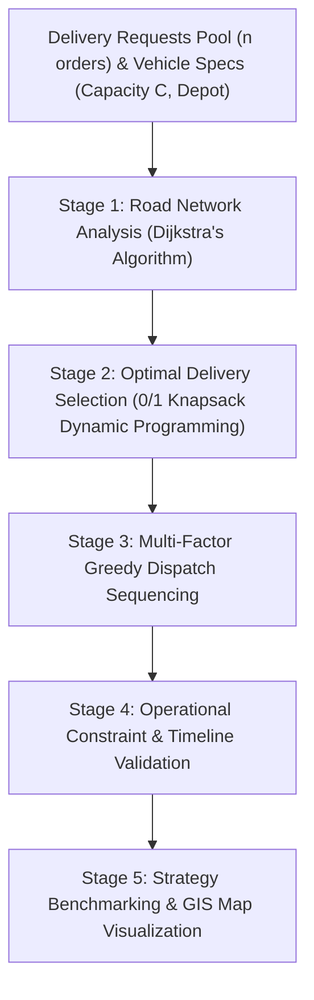

# RouteX — Intelligent Last-Mile Delivery Optimizer
> **"Select smarter. Route faster. Deliver on time."**
> 
> *College DAA PBL (Project-Based Learning) Flagship Project*  
> **Topic:** Last-Mile Delivery with Deadlines (0/1 Knapsack DP + Dijkstra + Greedy Heuristics + Timeline Feasibility)

---

## 1. Project Overview & Problem Statement

In contemporary urban logistics, last-mile delivery represents over **53% of total logistics costs**. Small and medium-sized delivery operators operate under strict vehicle weight limits, variable road traffic, and tight customer delivery deadlines. When customer demand exceeds vehicle capacity ($C$), dispatchers face a critical combinatorial optimization problem:

1. **Order Acceptance Problem:** Which delivery requests must be accepted to maximize total profit while strictly obeying vehicle payload capacity?
2. **Order Rejection Problem:** Which orders must be rejected because their inclusion yields suboptimal profit or causes deadline violations?
3. **Dispatch Sequencing Problem:** In what sequence should accepted orders be delivered to ensure all customer delivery windows are satisfied?
4. **Network Routing Problem:** What is the shortest-travel path across the urban road network accounting for real-time traffic congestion?
5. **Timeline Feasibility:** Can every customer order be fulfilled on time, and what is the slack time margin?

**RouteX** is a production-grade algorithmic decision-support and route-optimization system designed to solve this multi-stage pipeline deterministically without mock data or simulated numbers.

---

## 2. Multi-Stage Algorithmic Architecture

The optimization pipeline executes in five sequential algorithmic stages:



---

## 3. Detailed Algorithmic Formulations & Complexity

### Algorithm A: 0/1 Knapsack via Dynamic Programming (Order Selection)
- **Role:** Selects the global profit-maximizing subset of deliveries that fits within integer vehicle capacity $C$.
- **Assumption:** Vehicle capacity is discretized into kilograms ($1\text{ kg}$ resolution).
- **Recurrence Relation:**
  $$\text{dp}[i][c] = \begin{cases} \max\left(\text{dp}[i-1][c],\, \text{profit}[i] + \text{dp}[i-1][c - \text{weight}[i]]\right) & \text{if } \text{weight}[i] \le c \\ \text{dp}[i-1][c] & \text{otherwise} \end{cases}$$
- **Backtracking:** Reconstructs the exact list of accepted delivery IDs by walking backward from $\text{dp}[n][C]$:
  $$\text{if } \text{dp}[i][c] \neq \text{dp}[i-1][c] \implies \text{Delivery } i \text{ is SELECTED, } c \leftarrow c - \text{weight}[i]$$
- **Complexity:**
  - **Time Complexity:** $\mathcal{O}(n \cdot C)$
  - **Space Complexity:** $\mathcal{O}(n \cdot C)$
  - **Classification:** Exact Optimal Algorithm.

### Algorithm B: Dijkstra's Shortest Path Algorithm (Network Travel Times)
- **Role:** Finds the shortest road network travel path and duration between transfer hubs and delivery waypoints.
- **Graph Formulation:** Weighted undirected graph $G = (V, E)$, with edge weights representing travel times scaled by a dynamic traffic multiplier:
  $$\text{Weight}(u, v) = \text{base\_travel\_time}(u, v) \times \text{traffic\_multiplier}$$
- **Implementation:** Binary min-heap priority queue via Python `heapq`.
- **Complexity:**
  - **Time Complexity:** $\mathcal{O}((V + E) \log V)$
  - **Space Complexity:** $\mathcal{O}(V + E)$
  - **Classification:** Exact Optimal Single-Source Shortest Path.

### Algorithm C: Deadline-Aware Greedy Heuristic (Route Construction)
- **Role:** Sequences accepted deliveries into an efficient delivery schedule starting and terminating at the Depot.
- **Formulas:**
  $$\text{Urgency}_i = 1 + \max\left(0,\, \frac{\text{MaxDeadline} - \text{RemainingTime}_i}{\text{MaxDeadline}}\right)$$
  $$\text{PriorityScore}_i = \frac{\text{Profit}_i \times \text{Urgency}_i}{\max(0.1, \text{Weight}_i) \times \max(1.0, \text{EstimatedTravelTime}_i)}$$
- **Heuristic Step:**
  1. At current time $T$ and location $L$, evaluate all unvisited accepted deliveries.
  2. Compute travel time from $L \to \text{Pickup}_i \to \text{Drop}_i$.
  3. Verify deadline feasibility: $\text{Slack}_i = \text{Deadline}_i - (T + \text{TravelTime}) \ge 0$.
  4. Greedily select candidate with highest $\text{PriorityScore}_i$.
  5. Advance vehicle clock by travel time $+$ service time, and set current location to $\text{Drop}_i$.
  6. Return to Depot when all deliveries are satisfied.
- **Complexity:**
  - **Time Complexity:** $\mathcal{O}(k^2)$, where $k \le n$ is the number of selected deliveries.
  - **Space Complexity:** $\mathcal{O}(k)$.
  - **Classification:** Heuristic (Approximation).

### Algorithm D: Constraint & Schedule Validator
- **Role:** Verifies all physical and contract guarantees:
  1. $\sum \text{weight}_i \le C$ (Payload limit)
  2. $\text{ETA}_i \le \text{Deadline}_i \implies \text{Slack}_i \ge 0$ (On-time guarantee)
  3. $T_{\text{total}} \le \text{MaxOperatingTime}$ (Driver shift limit)
  4. Pickup Precedence: $\text{Pickup}_i$ stop occurs before $\text{Drop}_i$.
  5. Route continuity: Consecutive legs share waypoints.

---

## 4. Academic Complexity Comparison Table

| Algorithm | Primary Role | Time Complexity | Space Complexity | Mathematical Nature | Optimality Guarantee |
| :--- | :--- | :--- | :--- | :--- | :--- |
| **0/1 Knapsack DP** | Payload Selection | $\mathcal{O}(n \cdot C)$ | $\mathcal{O}(n \cdot C)$ | Dynamic Programming | **Globally Optimal** |
| **Dijkstra** | Road Routing | $\mathcal{O}((V+E)\log V)$ | $\mathcal{O}(V+E)$ | Greedy / Min-Heap | **Globally Optimal** |
| **Deadline Greedy** | Route Sequencing | $\mathcal{O}(k^2)$ | $\mathcal{O}(k)$ | Multi-Factor Heuristic | **Practical Heuristic** |
| **Schedule Validator**| Feasibility Check | $\mathcal{O}(k)$ | $\mathcal{O}(k)$ | Constraint Audit | **Exact Verification** |

---

## 5. Technology Stack

- **Backend:**
  - Python 3.14+
  - FastAPI (REST API Engine)
  - Pydantic v2 (Data Validation & Schemas)
  - Uvicorn (ASGI Production Server)
  - Pytest (Automated Algorithm & API Test Suite)
- **Frontend:**
  - React 19 + TypeScript
  - Vite (Build Tool & HMR Dev Server)
  - Tailwind CSS v4 (Modern Dark Navy Logistics Design System)
  - Leaflet & OpenStreetMap (Interactive GIS Route Mapping)
  - Recharts (Algorithmic Comparative Analytics)
  - Lucide React (Icons)

---

## 6. Project Structure

```
PBL_DAA/
├── backend/
│   ├── app/
│   │   ├── algorithms/
│   │   │   ├── knapsack.py     # 0/1 Knapsack DP + backtracking + visualizer trace
│   │   │   ├── dijkstra.py     # Binary min-heap Dijkstra + relaxation trace
│   │   │   ├── greedy.py       # Deadline-aware multi-factor greedy router
│   │   │   ├── routing.py      # End-to-end coordinator & 3-strategy comparison
│   │   │   └── validation.py   # Timeline, capacity, and precedence validation
│   │   ├── data/
│   │   │   └── dataset.py      # 10 urban nodes, 25+ road edges, 15 deliveries
│   │   ├── models/
│   │   │   └── schemas.py      # Pydantic data contracts
│   │   └── main.py             # FastAPI REST endpoints
│   ├── tests/
│   │   ├── test_knapsack.py    # Unit tests for Knapsack edge cases
│   │   ├── test_dijkstra.py    # Unit tests for Dijkstra on graphs
│   │   ├── test_greedy.py      # Unit tests for greedy routing & deadlines
│   │   ├── test_validation.py  # Unit tests for constraints
│   │   └── test_api.py         # Integration tests for REST endpoints
│   └── .venv/                  # Python virtual environment
├── frontend/
│   ├── src/
│   │   ├── components/
│   │   │   ├── Header.tsx               # Top action bar with quick run
│   │   │   ├── Sidebar.tsx              # Dark navigation drawer
│   │   │   ├── MetricCard.tsx           # KPI status card
│   │   │   ├── MapComponent.tsx         # Leaflet interactive map & markers
│   │   │   ├── DeliveryModal.tsx        # Add/edit order modal
│   │   │   └── VehicleSettingsModal.tsx # Vehicle payload configuration
│   │   ├── pages/
│   │   │   ├── DashboardPage.tsx        # Screen 1: Operational overview
│   │   │   ├── DeliveriesPage.tsx       # Screen 2: Delivery CRUD management
│   │   │   ├── MapRoutePage.tsx         # Screen 3: Interactive GIS map
│   │   │   ├── OptimizationPage.tsx     # Screens 4, 5, 8: 3-step pipeline
│   │   │   ├── VisualizerPage.tsx       # Deep DAA step-by-step visualizer
│   │   │   ├── SimulationPage.tsx       # Screen 7: What-If sensitivity sliders
│   │   │   ├── ComparisonPage.tsx       # Screen 6: 3-Strategy benchmarking
│   │   │   └── ReportsPage.tsx          # Screen 10: Dispatch manifest & Viva
│   │   ├── services/
│   │   │   └── api.ts                   # Backend REST client
│   │   ├── types/
│   │   │   └── index.ts                 # TypeScript type interfaces
│   │   ├── App.tsx                      # Root component
│   │   ├── main.tsx                     # React entrypoint
│   │   └── index.css                    # Tailwind v4 & Leaflet theme
│   ├── package.json
│   └── vite.config.ts
├── README.md                            # Comprehensive academic documentation
└── run.bat                              # One-click dual launcher script
```

---

## 7. Installation & Quick Start

### Prerequisites
- Python 3.10+ (Tested on Python 3.14)
- Node.js 18+ (Tested on v24.18)

### Step 1: Clone or Navigate to Directory
```bash
cd c:\Users\asus\Desktop\PBL_DAA
```

### Step 2: Backend Setup
```bash
# Create and activate virtual environment
python -m venv backend\.venv
backend\.venv\Scripts\activate

# Install backend dependencies
pip install fastapi uvicorn pydantic pytest httpx

# Run automated tests
pytest backend/tests -v
```

### Step 3: Frontend Setup
```bash
cd frontend
npm install
npm run build
```

### Step 4: Run Application
**Option A: One-Click Startup Script (Windows)**
Run `run.bat` in the root folder.

**Option B: Manual Terminal Execution**
- **Terminal 1 (Backend):**
  ```bash
  cd c:\Users\asus\Desktop\PBL_DAA
  $env:PYTHONPATH="."
  backend\.venv\Scripts\python -m uvicorn backend.app.main:app --host 127.0.0.1 --port 8001
  ```
- **Terminal 2 (Frontend):**
  ```bash
  cd c:\Users\asus\Desktop\PBL_DAA\frontend
  npm run dev
  ```
- Open your browser at: **`http://localhost:5173`**

---

## 8. Guided 5–10 Minute Viva Demonstration Script

1. **Open the Application (`http://localhost:5173`)**:
   - Point out the dark navy SaaS logistics aesthetic, matching the reference design montage.
   - Show the 4 top metrics: Total Profit (₹3,010), Deliveries (selected vs total), Distance (km), and Vehicle Load (19 / 20 kg, 95% utilized).
2. **Interactive Viva Defense Mode (`🎓 Viva Defense Mode` in Header)**:
   - Click the prominent **"🎓 Viva Defense Mode"** button in the top navigation bar.
   - **Tab 1 (Live Recurrence Calculator):** Pick any order and sub-capacity to show the exact arithmetic behind Bellman's equation evaluating `INCLUDE` vs `EXCLUDE`.
   - **Tab 2 (Asymptotic Complexities):** Show the formal Big-O proofs and comparison against non-optimal algorithms.
   - **Tab 3 (Faculty Stress-Tests):** Click *"Severe Peak-Hour Traffic (2.0x)"* or *"Fleet Capacity Crunch (12 kg)"* to demonstrate instant real-time algorithmic recalculation.
   - **Tab 4 (Examiner Q&A):** Review the model defense answers for the toughest faculty questions.
3. **Multi-Stage Optimization (`Optimization` Tab)**:
   - **Tab 1 (DP Selection):** Show the 2D DP Table with cyan/blue highlighted optimal backtracking path. Click any cell to trigger the **DP Cell Inspector**.
   - **Tab 2 (Greedy Prioritization):** Show the mathematical formula banner and ranking table with Urgency and Priority scores.
   - **Tab 3 (Detailed Schedule):** Show the exact timeline with Vehicle Load (kg), Arrival, Departure, Deadline, and Slack ($+\text{min}$ on time).
4. **Algorithm Visualizer (`Visualizer` Tab)**:
   - Play/step through cell-by-cell evaluations of the Knapsack table with plain-English comparisons ("Include yields Rs.X > Exclude Rs.Y").
   - Switch to Dijkstra to show min-heap extraction and edge relaxation.
   - Switch to Greedy to show vehicle dispatch decisions step by step.
5. **Interactive Map & Live Vehicle Simulator (`Map & Route` Tab)**:
   - Watch the animated delivery van move stop-by-stop along the route with live payload and timeline HUD updates.
6. **Algorithm Comparison (`Comparison` Tab)**:
   - Show side-by-side bar charts comparing **Nearest Neighbor**, **Profit-based Greedy**, and **RouteX (DP + Greedy + Dijkstra)** on the identical dataset.
   - Highlight why RouteX achieves higher profit (Rs. 3,010) and higher on-time rates.
7. **What-If Simulation (`Simulation` Tab)**:
   - Adjust vehicle capacity or traffic multiplier and run deterministic sensitivity tests.
8. **Reports & Viva Dossier (`Reports` Tab)**:
   - Show the formal asymptotic complexity table, print manifest, and CSV export.

---

## 9. Automated Testing & Verification

19 comprehensive automated tests verify all algorithms:
- `test_knapsack_normal`: Verifies knapsack selection and backtracking.
- `test_knapsack_zero_capacity`: Zero capacity handling.
- `test_knapsack_item_heavier_than_capacity`: Excludes overweight items.
- `test_knapsack_multiple_optimal`: Handles multiple solutions deterministically.
- `test_knapsack_fractional_weights`: Fixed-point scaling ensuring fractional weights never exceed capacity.
- `test_dijkstra_normal_graph`: Shortest path and min travel time.
- `test_dijkstra_single_node` & `test_dijkstra_disconnected_graph`: Graph edge cases.
- `test_greedy_feasible_deliveries`: Proper stop sequencing and depot return.
- `test_greedy_impossible_deadlines`: Flags late deliveries with negative slack.
- `test_validation_capacity_violation` & `test_validation_deadline_violation`: Audits physical constraints.
- `test_api_*`: Full REST integration verification across all endpoints.

Run all tests:
```bash
backend\.venv\Scripts\pytest -v
```

---

## 10. Authors & Academic Credits
- **Project:** RouteX — Intelligent Last-Mile Delivery Optimizer
- **Course:** Design & Analysis of Algorithms (DAA) — Project-Based Learning (PBL)
- **Topic:** Last-Mile Delivery with Deadlines
